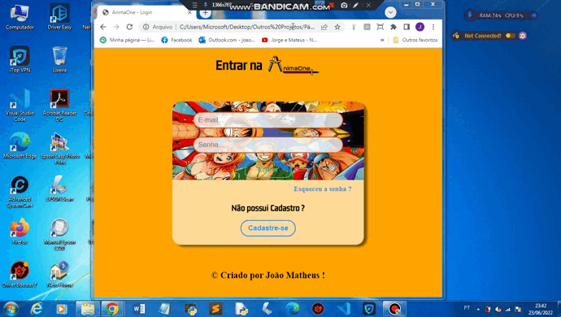
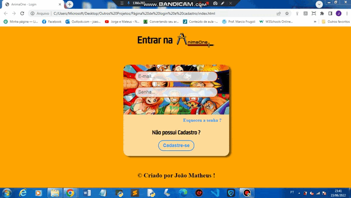
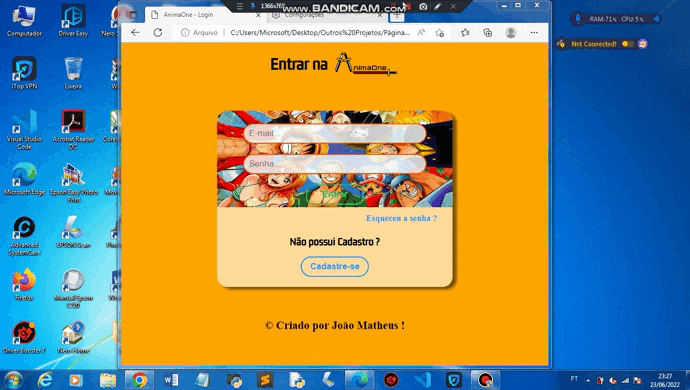
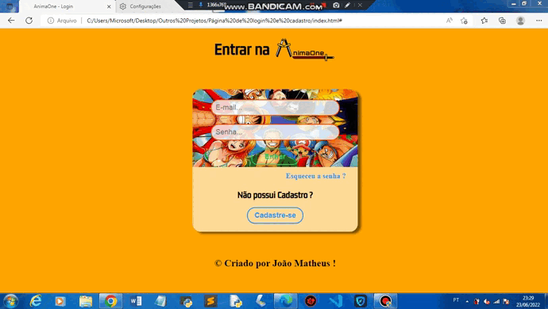

## Página de Login e Página de Cadastro

* Basicamente, este projeto possui uma página com um formulário de Login fictício. E outra página, com um formulário de Cadastro fictício.

* A Logo da AnimaOne foi eu que desenvolvir, este é o repositório, onde está o Desenho da logo: <a href="https://github.com/joao3872/Desenhos_HTML5_CSS3/" target="_blank">Acessar</a>.

* E as duas páginas, possui o modo escuro.

### Versão Mobile 📱:

### Tablet :

### Versão Desktop 💻:

### Dark Mode Mobile 🌑:

### Dark Mode Tablet 🌑:

### Dark Mode Desktop 🌑:

### Experimente você mesmo:

* #### <a href="https://joao3872.github.io/Pagina_Login_Cadastro/" target="_blank">Acesse Aqui</a>

### Crédito das Imagens:

* Fonte: <a href="https://www.google.com/amp/s/br.ign.com/one-piece-2/98999/news/one-piece-manga-entrara-em-hiato-em-junho-confira-a-data-de-retorno%3famp=1" target="_blank">IGN Brasil</a>

* Fonte: <a href="https://www.justwatch.com/br/serie/one-piece-1999" target="_blank">JustWatch</a>
