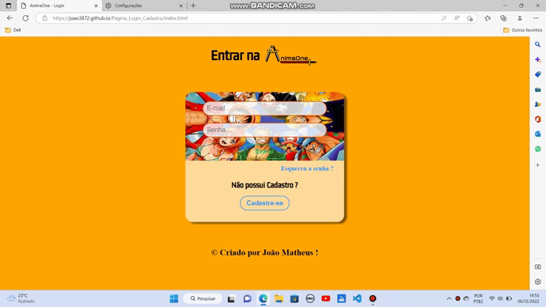

## Página de Login e Página de Cadastro

* Basicamente, este projeto possui uma página com um formulário de Login fictício. E outra página, com um formulário de Cadastro fictício.

* A Logo da AnimaOne foi eu que desenvolvir, este é o repositório, onde está o Desenho da logo: <a href="https://github.com/joao3872/Desenhos_HTML5_CSS3/" target="_blank">Acessar</a>.

* E as duas páginas, possui o modo escuro.

### Versão Mobile :

### Tablet :

### Versão Desktop :

### Dark Mode Mobile :

### Dark Mode Tablet :

### Dark Mode Desktop :

